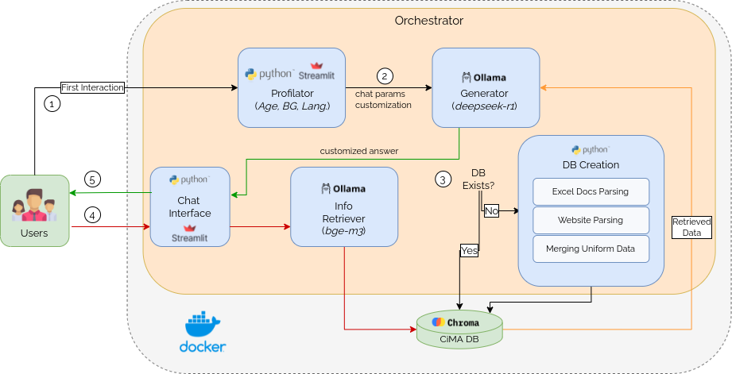

# Multi-Agent Museum Assistant

<div align="center">
 
</div>

## Overview

The Multi-Agent Museum Assistant project aims to provide an interactive and intelligent assistant for museum visitors. The system leverages multiple agents to enhance the visitor experience by providing detailed information and guidance throughout the museum.

## Features

- **Interactive Assistance**: Provides real-time information and guidance to museum visitors.
- **Multi-Agent System**: Utilizes multiple agents to handle different tasks and improve efficiency.
- **Customized Museum Experience**: Uses LLMs and RAG to provide customized answers to the visitors

## Pre-requisites

The following steps require CUDA installed on your system

1. **Install Ollama**:
    ```sh
    curl -fsSL https://ollama.com/install.sh | sh
    ```
2. **Download Ollama Models**:
    ```sh
    ollama serve # Start Ollama 
   ollama pull deepseek-r1 # LLM model (see src/config.py)
   ollama pull bge-m3 # embedding model (see src/config.py)
    ```
   
3. **Install Docker (Optional)**:
   <br><br>
   3.1. Add Docker's official GPG key:
    ```sh
   sudo apt-get update
   sudo apt-get install ca-certificates curl
   sudo install -m 0755 -d /etc/apt/keyrings
   sudo curl -fsSL https://download.docker.com/linux/ubuntu/gpg -o /etc/apt/keyrings/docker.asc
   sudo chmod a+r /etc/apt/keyrings/docker.asc
    ```
   3.2. Install Docker:
   ```sh
   sudo apt-get install docker-ce docker-ce-cli containerd.io docker-buildx-plugin docker-compose-plugin
   sudo apt-get install -y docker-ce-rootless-extras
   ```
   3.3. Install GPU support for containers:
   ```sh
   curl -fsSL https://nvidia.github.io/libnvidia-container/gpgkey | sudo gpg --dearmor -o /usr/share/keyrings/nvidia-container-toolkit-keyring.gpg \
   && curl -s -L https://nvidia.github.io/libnvidia-container/stable/deb/nvidia-container-toolkit.list | \
   sed 's#deb https://#deb [signed-by=/usr/share/keyrings/nvidia-container-toolkit-keyring.gpg] https://#g' | \
   sudo tee /etc/apt/sources.list.d/nvidia-container-toolkit.list
   ```
   ```sh
   sudo apt-get update
   sudo apt-get install -y nvidia-container-toolkit
   ```

   3.4. Verify that the installation is successful by running the hello-world image:

   ```sh
   sudo docker run hello-world
    ```
   
4. **Download Local Translations Server (Optional):**
   <br>You can either: 
   <br> Download the repo in a separate project (follow the provided installation and execution steps)
    ```sh
    git clone https://github.com/atzoriandrea/Local-Translation-Server.git
    ```
   or Download and run this docker image (link) with the following command
   ```sh
   docker load --input translation-server.tar
   docker run --gpus all -d -p 2048:2048 translation-server # It will listen on port 2048
    ```
   
## Installation

A docker image of this system will be provided soon. In the meanwhile...

To set up the project, follow these steps:

1. **Clone the repository**:
    ```sh
    git clone https://github.com/yourusername/multi-agent-museum-assistant.git
    cd multi-agent-museum-assistant
    ```

2. **Set up the Python environment**:
    ```sh
    python3 -m venv .venv
    source .venv/bin/activate
    ```

3. **Install the dependencies**:
    ```sh
    pip install --no-cache-dir -r requirements.txt
    ```
   
4. **Get your DeepL API key**:
    <br>Create and download an API key from <a href=https://www.deepl.com/en/your-account/keys>this link</a> (You MUST be registered to DeepL)

   Copy your key into the ```api_key``` field inside ```src/api.py```

## Usage

To run the application, use the following commands:
   ```sh
      cd src
      streamlit run orchestrator.py
   ```